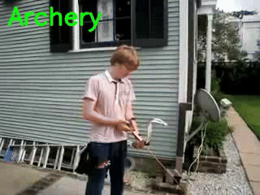

# Activity-Detection
Michael Wu's Activity Detection PyTorch Pipeline

---

## Link to Model Weights
Download the pretrained model weights here:  
[Google Drive Folder](https://drive.google.com/drive/folders/1WpXRZufWkWNnZV7-rLQLcWl6QNvG1vGy?usp=sharing)

---

## Classification Model
This PyTorch pipeline predicts activities in videos using deep learning.

---

## Example Predictions

Here are some example activity videos demonstrated as GIFs:

  

  

  

---

To do:
`Segmentation ability` as of 6/12/25
